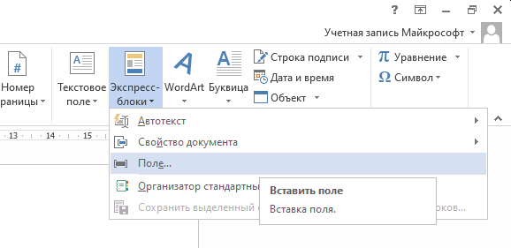
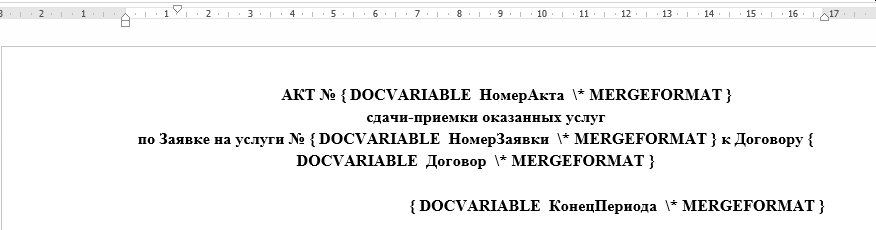
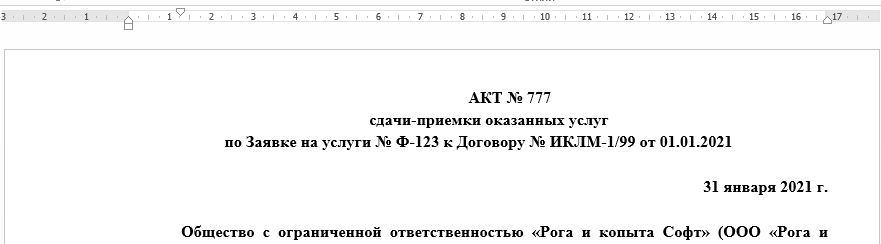
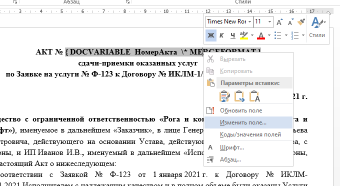
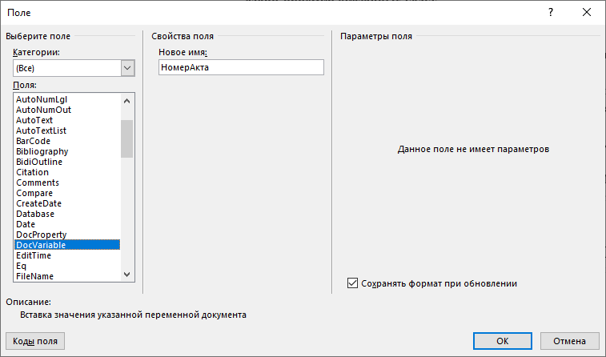

# DocTempl

## Формирование документов из шаблонов MS Word

Скрипт предназначен для автоматизации случая, когда требуется создание одинаковых документов MS Word с отличающимися реквизитами. 
Например договоры или акты выполненных работ и приложения к ним.

Для исключения рутинной операции замены в таких файлах отдельных реквизитов все подобные значения выносятся в файл параметров и изменяются в нём.

Данный скрипт форммирует пакет документов на основе заранее созданных *.docx шаблонов, заполняя эти шаблоны из файла с данными для подстановки.

## Установка

Скачать архив со скриптом, [последняя версия скрипта](https://github.com/mazurin/DocTempl/archive/refs/heads/main.zip)

Распаковать полученный архив в отдельный каталог

## Рекомендации по использованию

Файлы шаблонов и файл подставляемых данных рекомендую хранить в отдельном каталоге.
Перед формированием файлов необходимо скопировать файл данных в отдельный каталог, заполнить необходимые значения переменных и запустить скрипт на выполнение.

## Пример запуска

В каталоге 2021.01 выполнить команду 

    powershell.exe -ExecutionPolicy Bypass -File ..\DocTempl.ps1 РогаИКопыта-Иванов.txt

где 
* **powershell.exe** - интерпретатор языка PowerShell (уже установлен в последних версиях Windows)
* **DocTempl.ps1** - скрипт для формирования документов
* **РогаИКопыта-Иванов.txt** - файл с данными переносимыми в шаблоны документов

После выполнения скрипта в нём будут созданы три файла

    ИП Иванов И.В._ФабрикаАБВГД_Январь 2021 г._Акт сдачи-приемки оказанных услуг № 777.docx  
    ИП Иванов И.В._ФабрикаАБВГД_Январь 2021 г._Заявка на услуги № Ф-123.docx  
    ИП Иванов И.В._ФабрикаАБВГД_Январь 2021 г._Отчёт об оказанных услугах № Ф-123.docx  

## Описание файла данных

В каталоге 2021.01 находится пример [файла](2021.01/РогаИКопыта-Иванов.txt)

Файл данных состоит из двух секций 

### Секция [Шаблоны] 

Cодержит список обрабатываемых шаблонов, в каждой строке секции указывается путь и имя файла шаблона.
Имена файлов могу содержать переменные, которые при сохранении будут заменены значениями из секции [Поля].

### Секция [Поля] 

Cодержит список полей с данными, которые будут подставленны в поля шаблонов из первой секции
В этой секции имена переменных отделены от значения символом **=**

## Содание шаблонов

Примеры шаблонов расположены в каталоге [template](template). Для того чтобы разобраться с там как формировать шаблоны, откройте любой *.docx файл из этого каталога 
и нажмите клавиши **Alt+F9**.

В docx файлах в необходимые места вставляются поля с типом "DocVariable", которым задаются имена.
Скрипт выберет из файла данных имена переменных и заполнит их значения в каждом указанном шаблоне. 

Вставку можно выполнить с помощью пункта меню  
  

Переключение между режимом отображения кодов полей и их представлением выполняется с помощью клавиш **Alt+F9**

Режим промсотра кодов полей  
  

Режим представления значений полей (нормальный режим)  
  

Пример изменения/добавления поля  
  
  

## Ссылки

[Описание поля DocVariable](https://support.microsoft.com/ru-ru/office/%d0%ba%d0%be%d0%b4%d1%8b-%d0%bf%d0%be%d0%bb%d0%b5%d0%b9-docvariable-32a81e22-c5c1-4b16-8097-f0de851db67c?ui=ru-RU&rs=ru-RU&ad=RU)

[Список сочетаний клавиш для работы с полями](https://support.microsoft.com/ru-ru/topic/%D1%81%D0%BE%D1%87%D0%B5%D1%82%D0%B0%D0%BD%D0%B8%D1%8F-%D0%BA%D0%BB%D0%B0%D0%B2%D0%B8%D1%88-%D0%B2-word-95ef89dd-7142-4b50-afb2-f762f663ceb2#bkmk_mergefieldswin)